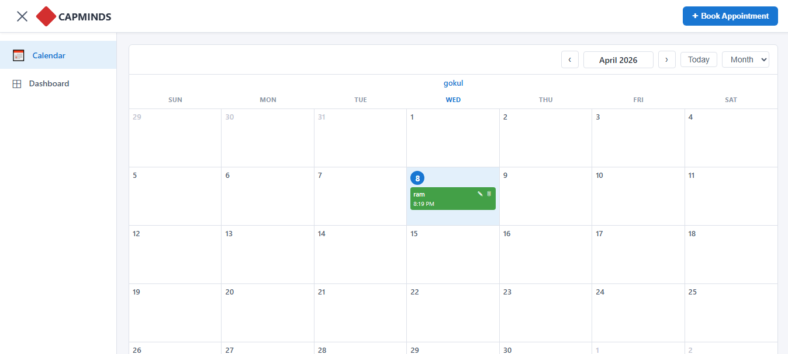
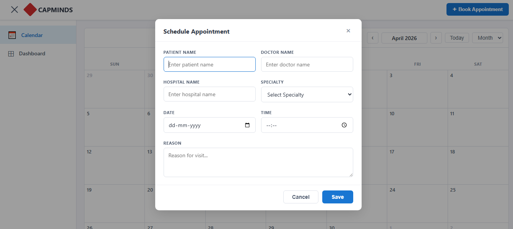
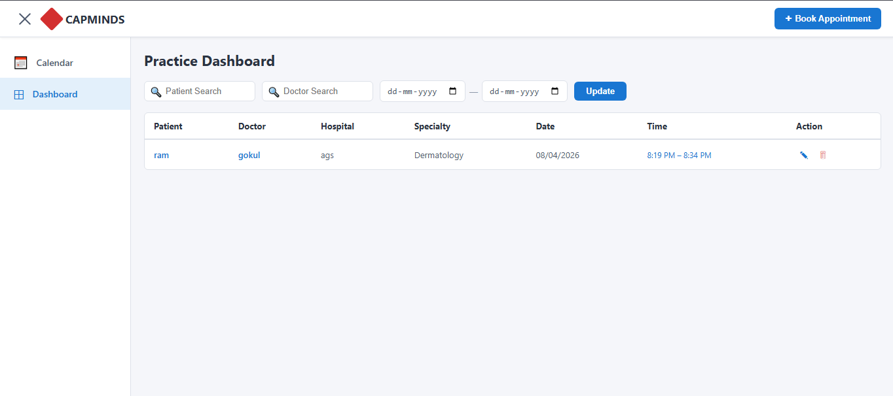

# 🏥 Appointment Scheduler

A responsive Appointment Scheduling web application built using **HTML, CSS, and JavaScript**.
This application allows users to book, manage, and view appointments in a calendar and dashboard interface.

---

## 🚀 Live Demo

🔗 https://appointment-scheduler-swart.vercel.app/

---

## 📸 Screenshots

### 📅 Calendar View



### 📝 Book Appointment Modal



### 📊 Dashboard View



---

## 📌 Features

### 📅 Calendar View

* Monthly calendar layout
* Displays appointments on selected dates
* Highlights current day

### 📝 Book Appointment

* Add patient name, doctor name, hospital, specialty
* Select date and time
* Add reason for visit

### ✏️ Edit Appointment

* Modify existing appointment details

### 🗑️ Delete Appointment

* Remove appointments instantly from calendar and dashboard

### 📊 Dashboard

* Displays all appointments in table format
* Includes edit and delete actions

### 🔍 Search & Filter

* Search by patient name
* Search by doctor name
* Filter by date range

### 📱 Responsive Design

* Works on Mobile, Tablet, and Desktop

---

## 🛠️ Tech Stack

* HTML5
* CSS3
* JavaScript (Vanilla JS)
* localStorage (for data persistence)

---

## 💾 Data Storage

All appointment data is stored in the browser using **localStorage**.
No backend or database is used.

---

## 📂 Project Structure

```
index.html
calendar.png
modal.png
dashboard.png
```

---

## ⚙️ How to Run Locally

1. Clone the repository
2. Open `index.html` in your browser

---

## 🎯 Objective

This project was developed as part of a technical assessment to demonstrate:

* Frontend development skills
* DOM manipulation
* State management using localStorage
* Responsive UI design

---

## 👤 Author

**Gokul Selvan**
